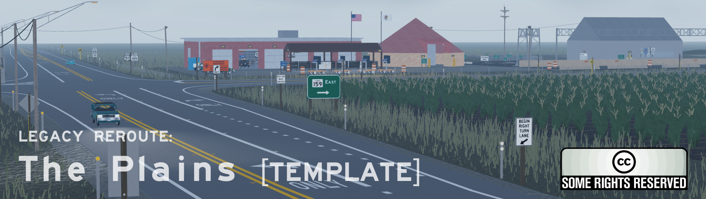

# Legacy Reroute: The Plains 

**Group / Jurisdiction: Project Roadwork**

A free, open source and open content template situated in a fictional rural area of Illinois with a focus towards MUTCD compliance, intended to provide a higher level of MUTCD accuracy than typical starter templates.
	
**Releases: [Legacy Reroute: The Plains Release Files - Codeberg](https://codeberg.org/project-roadwork/the-plains/releases)**

	
## A. LICENSE AND NOTICES

* **The content of *"The Plains"* is licensed under the [Creative Commons Attribution 4.0 license](https://creativecommons.org/licenses/by/4.0/).**
	
* The *"LICENSE-CONTENT"* file refers to the license OF non-software content such as maps, unions, etc. This does not encompass or include software.
	
* License information regarding software can be found in the NOTICE file in this repository or game/place folder.

## B. Scope
This Git repository is meant to hold place files rather than source *code*, and is **NOT** compatible with certain package managers such as Wally, Pesde, etc.

## C. Resource Links and Git Notices

**OFFICIAL DEVFORUM PAGE AND ATTRIBUTIONS:** https://devforum.roblox.com/t/4108410/
	
**(ℹ️ MAIN) CODEBERG REPOSITORY:** https://codeberg.org/project-roadwork/the-plains 

**(❌ BACKUP/MIRRORED) GITHUB REPOSITORY:** https://github.com/project-roadwork/the-plains 

***Please use the main repository especially with pull requests, contributions, and issues!** Additionally, please **DO NOT** make any changes in the mirrored repository as it cannot be pulled into the main repo.*

## D. Contributing

All open source / open content contributions are welcome! **However, it must be reviewed before it is merged into the main place.** 
*Additionally, it is recommended that you are in the [communications server](https://discord.gg/sd4XfAqNF9) when you are submitting a contribution.*

## E. Miscellaneous

**Why is the playground place not uncopylocked?** The playground place is not properly configured for individual "release" files, and may be unstable. **Therefore, it is more suitable to get the [official release files](https://codeberg.org/project-roadwork/the-plains/releases) from the Git platform.**

**Do you need assistance OR have any questions/concerns? Reach out in my [communications server](https://discord.gg/sd4XfAqNF9).** *Please reach out if you find any MUTCD violations as well :)*

---

Provided in good faith from the open source world.